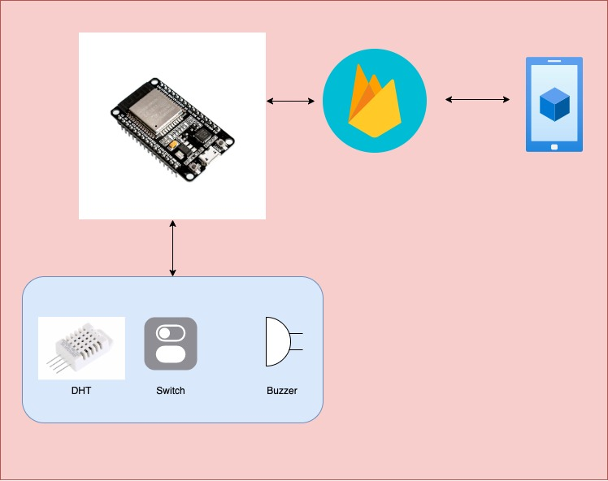

## :cat: SmartPetFeeder :
>This is IoT system for Feed animals :hamster: by switch that connect with ESP32S or User can set time for auto feed animals by set time in :iphone: application that connect with firebase realtime database.


-----
#### :dog: Variable Require:
Please input variable require in ``` ./src/main.ino ```

|   Variable    |    Please Input    |
| ------------- | ------------------ |
| FIREBASE_HOST | Your_FirebaseHost  |
| FIREBASE_AUTH | Your_AUTH          |
| ssid          | Your_WIFI _SSID    |
| password      | Your_WIFI_password |


----
#### :rabbit: System Diagram :

